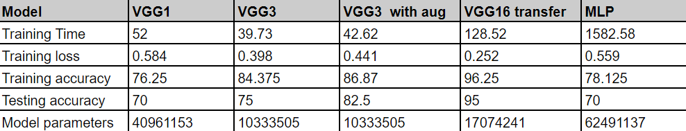

## Results

 

Q1. Are the results as expected? Why or why not?

    Yes, the results are more or less as expected. Barring a few results like the accuracy of VGG1 on training data is lower than that of MLP, the overall results follow the desired trend. Along the models, the number of layers increase which help the model to learn various complex and intricate features improving it's accuracy and model complexity. In MLP since it treats each feature as independent, it fails to learn about local features and hence has a poor record despite having the similar number of parameters.

Q2. Does data augmentation help? Why or why not?

    Deep learning models, especially those based on the VGG architecture, can benefit from data augmentation to perform better. Images can be rotated, flipped, and cropped as part of data augmentation approaches to provide the model access to more training data, which can help the model generalise to new, unexplored data.

    To learn from augmented data, the model needs to be deep and have smaller convolutional filters in order to learn intricate details, thus while data augmentation may be helpful in case of VGG3, it's effect is however limited.

Q3. Does it matter how many epochs you fine tune the model? Why or why not?

    The number of epochs is a hyperparameter. On one hand, less epochs may lead to underlearning or underfitting of the model, high number of epochs may lead to overfitting of the model. So it does matter how many epochs you fine tune the model. 

    Generally speaking, it is a good practise to keep an eye on the model's performance on a validation set during the fine-tuning phase and to halt training when the validation loss or accuracy begin to grow. This indicates that the model has overfitted the training set, and additional training may not be able to make the model perform better on fresh data.

Q4. Are there any particular images that the model is confused about? Why or why not?

    Since the classes are quite distinct, there may not be any image in which the model is confused about.

Q5. Now, create a MLP model with comparable number of parameters as VGG16 and compare your performance with the other models in the table. You can choose the distribution of number of neurons and number of layers. What can you conclude?

    An MLP model with the same number of parameters as VGG16 will perform worse than VGG16 on tasks requiring the extraction of complicated features from images, such as object detection or image classification. 
    
    This is due to the fact that MLP models are better suited for jobs that need learning from tabular data or data with a simple structure, whereas VGG16 models were especially created to extract rich and relevant features from images. 

    MLPs assume each feature to be independent whereas VGG's involving CNN's specialise in feature extraction because of spatial locality of convolutional filters. They are able to extract the local image structures which are what images contain in general. Hence MLP's are not suited for image/object detection despite having nearly the same number of parameters as VGGs/CNNs.

